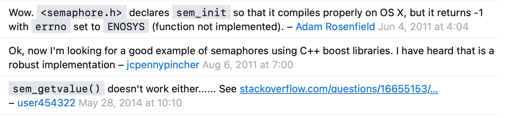
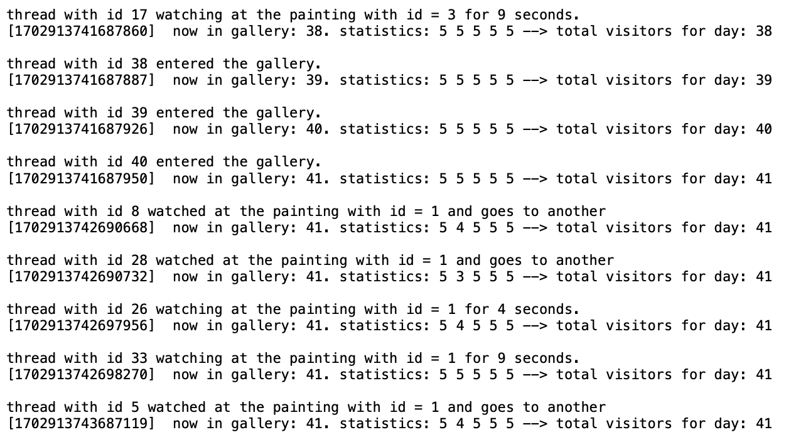
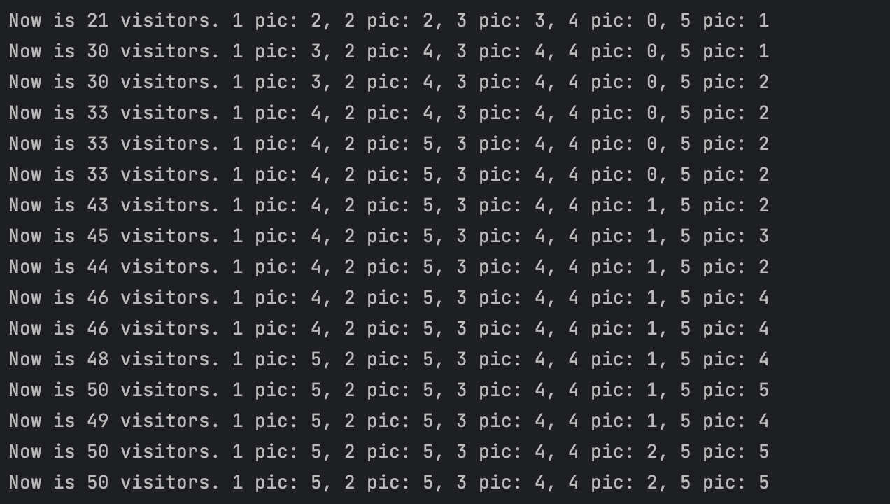

# ИДЗ №4 по курсу "Архитектура вычислительных систем"
## Тямин Илья Игоревич, БПИ-226
ОБ ИДЗ:
- Вариант №22
- Программа написана на **C++20** (это важно!)
- **Задача о картинной галерее**. Вахтер следит за тем, чтобы в картинной галерее одновременно было не более 50 посетителей. Для обозрения представлены 5 картин. Каждый посетитель случайно переходит от картины к картине, но если на желаемую картину любуются более десяти посетителей, он стоит в стороне и ждет, пока число желающих увидеть эту картину не станет меньше. Поcетитель покидает галерею по завершении осмотра всех картин. Каждый посетитель уникальный (имеет свой номер). В галерею также пытаются постоянно зайти новые посетители, которые ожидают своей очереди и разрешения от вахтера, если та заполнена. Создать многопоточное приложение, моделирующее однодневную работу картинной галереи (например, можно ограничить числом посетителей от 100 до 300). Вахтер и посетители — отдельные потоки.
- Работа выполнена на 9 баллов

### Два варианта решения программы
1. **С использованием семафоров**

В первом варианте программа была реализована при помощи такого синхропримитива, как семафор. Он был использован в двух целях: поддержания количества посетителей в галерее (чтобы оно было <= 50), а также поддержания количества смотрящих на каждую из картин в галерее (чтобы для каждой галереи это значение было <= 5). Синхронизация была реализована с помощью инициализации начального значения для каждого из семафор (50 для общего количества людей в галерее и 5 на каждую из картин), а также последующих блокировок и разблокировок соответствующих семафор.

<span style="color:red">**Очень важно!**</span> Мой вариант полностью основан на использовании семафоров. Программу я писал на маке, и оказалось, что ОС маков не поддерживает модель семафоров, описанных в заголовочном файле `semaphore.h`. Предоставлю доказательства, что мои слова имеют ценность :) [ссылка1](https://stackoverflow.com/questions/1413785/sem-init-on-os-x),  [ссылка2](https://stackoverflow.com/questions/41974248/set-of-counting-semaphores-are-not-working-on-mac-osx), [ссылка3](https://questu.ru/questions/641126/?ysclid=lq9zr855as876492300), [ссылка4](https://stackoverflow.com/questions/4136181/program-using-semaphores-runs-fine-on-linux-unexpected-results-on-mac-osx). Данные ссылки были актуальны на 2013-2014 года, в них написано, что Mac OS X не поддерживает неименнованные семафоры (которые объявляются, как и предложено в курсе, с помощью `sem_init`), при написании кода они объявлены как __deprecated__. Как говорят люди на форумах, Mac OS X поддерживает лишь именованные семафоры, предоставленные в библиотеке `pthread.h`, однако в ходе эксперимента было выяснено, что новые версии Mac OS X не поддерживают и их (при блокировке семафора, объявленного с начальным значением 0, ничего не происходило). 




Поэтому, **после разрешения Сергея Александровича**, вместо реализованных семафор в `semaphore.h` я использую реализованный в <u>C++20</u> `std::counting_semaphore`, объявленный в пакете `<semaphore>.`. Механизм его работы (необходимое количество строчек) ничем не отличается от `sem_t`. Приведу необходимый для понимания синтаксис:
- `sem_wait` реализован в используемой библиотеке как метод `acquire` у объекта семафора.
- `sem_post` реализован в используемой библиотеке как метод `release` у объекта семафора.
- сам семафор иницализируется автоматически при создании объекта `counting_semaphore`. Инициализация имеет синтаксис `std::counting_semaphore<T> semaphore(N)`, где T - максимальное значение, которое может принимать семафор, а N - его начальное значение.

Все остальные объекты многопоточного программирования (прямо все-все) реализуются из библиотеки `pthread_t` - потоки создаются из этой же библиотеки, мьютексы тоже. 

2. **С использованием условных переменных**

Также была разработана еще одна версия программы (на этот раз полностью с использованием pthread.h). Семафоры были заменены на условные переменные (conditional_variable), используемые совместно с мьютексами. 

### Про использование командной строки для вызова работы программы

ВНИМАНИЕ 2! Если пользователь хочет ввести данные через командную строку, то нужно обязательно прописать версию C++20 при этом:
```cpp
g++ -std=c++20 main.cpp -o main
```
У проверяющего (кто сейчас читает) может стоять версия по умолчанию C++17 (скорее всего), поэтому код может не скомпилироваться :(

## Предъявляемые репозитории (структура гита)
- [Код на 8 баллов](code_8p/) (с использованием семафоров)
- [Код на 9 баллов](code_9p/) (с использованием условных переменных)

## О коде на 8 баллов
### Сценарий ролевого поведения субъектов задачи
Есть галерея, в которой помещается только 50 человек.

На входе стоит вахтер, который позволяет только 50 людям зайти в галерею. Остальные стоят в очереди на вход. Как только какой-то один человек выходит из галереи, первый поток, который стоит в очереди на вход, может зайти. Остальные потоки ждут своей очереди.

Внутри галереи поток случайно подходит к 5 картинам (проиндексируем их от 0 до 4). Есть еще одно ограничение: вахтер не подпускает к картине более 5 человек одновременно. Если поток хочет подойти к картине, а там стоит 5 потоков, то он ждет в стороне, когда освободится место. 

У картины поток стоит случайное время. После этого переходит к другой картине (алгоритм такой же). После обхода всех картин поток выходит из галереи.

### Модель параллельных вычислений
Основным средством синхронизации потоков в данной программе является семафоры. Выбор данного способа обусловлен тем, что, грубо говоря, потоки-посетители являются равноправными. Приведу пример: если сейчас в галерее 50 человек и 51-й ожидает входа, то ему не обязательно ожидать пока именно 50-й выйдет из галереи, ему достаточно чтобы вышел любой из предыдущих 50-ти. 

Мьютекс не подходит под данную задачу, так как заблокированный мьютекс может разблокировать только этот поток. Однако в программе мьютексы используются для обеспечения порядка записи в файл и консоли (чтобы в файл все записывалось в нужном порядке) и во время единого доступа многих потоков к единому ресурсу (когда, например, много потоков обращаются к одному int-у).

### Входные данные
На вход функции `SolveTheTask()` поступает 2 параметра: название файла, куда сохраняются логи, а также количество ожидающих на вход посетителей. Если пользователь не указывает имя файла, куда сохраняются логи, тогда название по умолчанию файла - "log.txt".

Посетители не нуждаются ни в каких входных данных: их id генерируется с 0, а время задержки - случайное число от 1 секунды до 10 секунд. 

ВНИМАНИЕ! Если пользователь хочет ввести данные через командную строку, то нужно обязательно прописать версию C++20 при этом:
```cpp
g++ -std=c++20 main.cpp -o main
```

Возможные модели входных данных:
- ввод с консоли. Данные записываются в `log.txt`, количество посетителей вводится с консоли
- ввод с командный строки: вводится только количество посетителей. Логи записываются в `log.txt`
- ввод с командной строки: вводится сначала количество посетителей, а потом файл, куда данные логируются.
- ввод с командной строки: вводится только название конфигурационного файла. В конфигурационном файле сначала количество посетителей, а потом файл, куда данные логируются.

### Диапазоны генераторов случайных чисел
В задаче случайным определяется лишь время, в течение которого поток смотрит на картину: это от 1 секунды до 10 секунд. 

Задержка производится с помощью функции `sleep` из `<unistd.h>`.

### Содержание логов 
Логи выводятся в файл с названием по умолчанию "log.txt". Пользователь может изменить название файла, введя его или в командную строку или указав в конфигурационном файле. 

Я оставил файл, который может сгенерироваться в процессе выполнения программы - [он лежит тут](code_8p/cmake-build-debug/log.txt).

В файл записывается все, что происходит с потоками. После каждой ситуации также записывается еще и статистика по галерее: сколько сейчас людей там находится, количество людей, смотрящих на каждую из картин, и потом общее количество людей, сколько прошло в галерее за день.
- поток входит в галерею.
Пример:
```
thread with id 1 entered the gallery. 
[1702913741686589]  now in gallery: 1. statistics: 0 0 0 0 0 --> total visitors for day: 1
```
- поток начал смотреть на какую-то картину. При этом записывается еще дополнительно количество секунд. Пример:
```
thread with id 5 watching at the painting with id = 1 for 2 seconds.
[1702913741686682]  now in gallery: 4. statistics: 0 1 0 0 1 --> total visitors for day: 4
```
- поток закончил смотреть на какую-то картину. Пример:
```
thread with id 9 watched at the painting with id = 0 and goes to another
[1702913744690260]  now in gallery: 41. statistics: 3 4 5 5 5 --> total visitors for day: 41

```
- поток вышел из галереи
```
thread with id 7 came out from the gallery. 
[1702913788726038]  now in gallery: 12. statistics: 3 2 3 4 0 --> total visitors for day: 41
```

В квадратных скобках указывается "время" - количество тактов с начала эпохи.

Итого, в файл записывается все действия, которые происходят с каждым потоком.



### Вывод в консоль

**В тоже время в консоль** выводится более краткий отчет: о статистике по галерее на каждой итерации (могут быть пропущены каждые данные). Данное решение было принято из-за того, что данные слишком большие и слишком часто генерируются (ничего нельзя понять в слишком быстро меняющемся тексте).



### Как все это реализовано программно?
Некоторые программы состоят из слишком большого количества строк, поэтому я не прикрепляю их в отчет. Прикрепляю ссылки на файлы.

Программа состоит из следующих файлов:
#### main.cpp
[main.cpp](code_8p/main.cpp). Функция main, которая считывает данные с консоли или с командной строки (проверяет, является ли счетчик значений argc нулевым или нет), преобразовывает их (если из строки нужно получить) и вызывает функцию `SolveTheTask` с нужными параметрами. Функция `SolveTheTask` в себя принимает название файла, куда нужно логгировать и количество входных данных.

Main также в себя содержит две вспомогательные функции: `IsNumeric` (является ли строка числом) и `ReadConfigFile` - читающая конфигурационный файл при его наличии и возвращающая пару из строки и числа.
#### task.cpp
[task.cpp](code_8p/task.cpp). **Основной файл, в котором содержится решение всей задачи**. Рассмотрим его подробнее.

<b>Глобальные переменные</b>: 
- генератор случайных чисел с описанным выше диапазоном (в C++ сделать генератор рандомных чисел можно лишь в несколько этапов - поэтому 3 объекта)
```cpp
static std::random_device rd;
static std::mt19937 gen(rd());
static std::uniform_int_distribution<int> timeGen(1, 10);
``` 
- семафор вахтера для входа с начальным значением 50
```cpp
std::counting_semaphore<50> semaphoreForEntering(50);
```
- Вектор из семафор для удобной индексации `std::vector<void *> semForPainting;`

Здесь остановимся подробнее: так как у нас не 1 и не 2 картины, а 5 картин, то удобнее сделать массив, каждая семафора которого по ее индексу - семафор, отвечающий за $i$-ю картину. Поэтому в функции `SolveTheTask` я инициализирую 5 семафоров, а в вектор я вставляю адреса этих объектов, прикасченные к void*.

Как это выглядит в `SolveTheTask`:
```cpp
std::counting_semaphore<5> semForPainting1(5);
    std::counting_semaphore<5> semForPainting2(5);
    std::counting_semaphore<5> semForPainting3(5);
    std::counting_semaphore<5> semForPainting4(5);
    std::counting_semaphore<5> semForPainting5(5);

    semForPainting = {&semForPainting1, &semForPainting2, &semForPainting3, &semForPainting4,
                      &semForPainting5};
```


- Другое: как глобальными я инициализирую мьютекс для блокировки вектора во время записи в него (используя `pthread_mutex_init`, `pthread_mutex_lock`, `pthread_mutex_unlock`). Также объекты галереи (глобальный, чтобы был доступ из любых методов) и логгера.


<b>Сам алгоритм</b>: 
1. Метод `SolveTheTask` инициализирует все, что нужно и запускает поток вахтера (watchman). Как и в реальном мире, сначала в галерее появляется вахтер, а потом он пускает или не пускает всех посетителей :)
```cpp
pthread_create(&watchman, nullptr, WatchManAction, &numberOfThreads);
pthread_join(watchman, nullptr);
```
Данный поток имеет стартовую функцию `WatchManAction` и получает как аргумент количество потоков. Рассмотрим поподробнее:

2. Метод `WatchManAction`.

Он разыменует и создает потоков столько, сколько ему передали как параметр. Далее я создаю вектор из индексов потоков - зачем я это делаю? Это делается с целью того, чтобы передавать каждому потоку его индекс. Это нельзя делать просто так, так как C++ может перезатереть память из-за ее неиспользования. При этом если код будет выглядеть примерно так:
```cpp
// ЭТО НЕПРАВИЛЬНЫЙ КОД!
std::vector<int> numbers;
for (int i = 0; i < numOfThreads; ++i) {
    numbers.emplace_back(i);
    std::string message = "Thread with id = " + std::to_string(i) + " started working.";
    pthread_create(&visitors[i], nullptr, VisitorsActions, (void*)(&numbers[i]));
}
```
То может произойти переаллоцирование памяти (когда мы будем перерасширять массив), из-за чего могут возникнуть "висячие указатели".

```cpp
// Это правильный код
std::vector<int> numbers;
    for (int i = 0; i < numOfThreads; ++i) {
        numbers.emplace_back(i);
    }

    for (int i = 0; i < numOfThreads; ++i) {
        std::string message = "Thread with id = " + std::to_string(i) + " started working.";
        pthread_create(&visitors[i], nullptr, VisitorsActions, (void*)(&numbers[i]));
    }
```

В конце данный метод `join`-ит все запущенные потоки. Потоки запускаются с стартовой функцией `VisitorsActions`. Рассмотрим теперь ее.

3. Метод `VisitorsActions`.

В начале мы блокируем семафор входа. Если он станет -1 (изначально 50), то поток заблокируется - это позволяет первым 50-ти потокам проходить, а остальным ждать, пока освободится место и счетчик семафора вновь станет положительным.
```cpp
// ВНИМАНИЕ! здесь sem.acquire() аналогичен sem_wait() в терминах semaphore.h (см отчет)
semaphoreForEntering.acquire();
```

Затем "поток входит в галерею". Соответствующие данные выводятся как на экран, так и в файл  - при этом, чтобы не возникнул конфликт потоков (гонка потоков), то мы блокируем МЬЮТЕКСОМ запись в файл и на экран. 
```cpp
pthread_mutex_lock(&blockingVector);
gallery.AddToVisitorsCount(1, true);
logger.LogEnterTheGallery(num);
pthread_mutex_unlock(&blockingVector);
``` 

После этого мы перемешиваем вектор и получаем случайно сгенерированный порядок обхода картин:
```cpp
std::vector<int> paintings{0, 1, 2, 3, 4};
std::shuffle(paintings.begin(), paintings.end(), std::random_device());
```

Затем в цикле обходим эти картины. Аналогично семафору при входе в галерею, тут такая же механика, только стартовое значение семафора было 5 (так как на картину может смотреть максимум 5 человек). Мы также блокируем соответствующий картине семафор (обращаемся к ниму в массиве по индексу ), в конце разблокируем
```cpp
for (const int &element: paintings) {
    auto *x = static_cast<std::counting_semaphore<5> *>(semForPainting[element]);
    x->acquire();
    ...
    x->release();
}
```

Добавляем человека в счетчик и логируем все данные:
```cpp
gallery.AddHumanToPainting(element, 1);
// тут код с логированием, см в полном файле
```

Далее генеируется случайное число (на сколько поток засыпает), aka "смотрит на картину"
```cpp
int timeDuracity = timeGen(gen);
// здесь timeGen - генератор чисел от 1 до 10
```

Потом посетитель уходит к другой картине, соответствующие изменения записываются в логер:
```cpp
gallery.AddHumanToPainting(element, -1); // уходит от картины
logger.LogGoToAnotherPainting(num, element);
```

Соответствующий семафор разблокируется:
```cpp
x->release();
```

После того как отработали все итерации (посетили все картины), поток "уходит" из галереи (данные сохраняются в логи), возвращается nullptr, семафор ставится +1 (следующий поток в очереди может идти)
```cpp
gallery.AddToVisitorsCount(-1, false);
logger.LogCameOut(num);

// Уходим из галереи
// Внимание! здесь sem.release() аналогичен sem_post() в терминах semaphore.h (см отчет)
semaphoreForEntering.release();
```

#### logger.cpp
Представляет собой класс потоко-безопасного логгера, так как все записи в файл блокируются мьютексом. Мьютекс также создается благодаря библиотеке `pthread.h`, используя команды `pthread_mutex_init`, `pthread_mutex_lock`, `pthread_mutex_unlock`.

#### gallery.cpp
В данном файле представлен класс галерея, просто реализующий ряд прикладных методов, использующихся в `task.cpp`: `void AddToVisitorsCount(int value, bool isNew)` - для многопоточно-безопасного увеличения количества посетителей в галерее и `void AddHumanToPainting(int element, int value)` - для многопоточно-безопасного увеличения количества посетителей картины.

## О коде на 9 баллов
Код на 9 баллов представляет собой вторую реализацию данного программного решения, но с применением условных переменных (`pthread_cond`).
### Как это реализовано программно?
```cpp
// Набор из мьютекса и условной переменной для входа в галерею
pthread_cond_t entranceCond;
pthread_mutex_t entranceMutex;

pthread_cond_t condition[5];
pthread_mutex_t mutexPainting[5];
```
Для входа в галерею есть набор "условная переменная - мьютекс". Аналогично есть для каждой картины.

В методе `VisitorsActions`...
```cpp
// Используем conditional variable вместе с мьютексом
pthread_mutex_lock(&entranceMutex);
while (gallery.visitorsNow >= 50) {
    // Ждем пока количество людей в галерее станет < 50
    pthread_cond_wait(&entranceCond, &entranceMutex);
}
gallery.visitorsNow += 1;
gallery.total += 1;
pthread_mutex_unlock(&entranceMutex);
```
Ждем (`pthread_cond_wait`) пока количество посетителей >= 50. Как только посетитель (какой-то) уходит из галереи, он посылает условной переменной сигнал (РАССМОТРИМ ДАЛЬШЕ) и один поток проходит в галерею. Также мы увеличиваем текущее и общее количество посетителей.

Внутри цикла по картине...
```cpp
// Используем conditional variable вместе с мьютексом
pthread_mutex_lock(&mutexPainting[element]);
while (gallery.paintingCounter[element] >= 5) {
    // Ждем пока количество потоков, смотрящих на картину станет < 5.
    pthread_cond_wait(&condition[element], &mutexPainting[element]);
}
gallery.paintingCounter[element] += 1;
pthread_mutex_unlock(&mutexPainting[element]);
```
Ждем (`pthread_cond_wait`) пока количество посетителей, смотрящих на картину >= 5. Как только посетитель (какой-то) уходит к другой картине, он посылает условной переменной сигнал (РАССМОТРИМ ДАЛЬШЕ) и один поток проходит к картине. 

Так выглядит посылка сигнала:
```cpp
pthread_cond_signal(&condition[element]);
```

В остальном, решение не отличается от предоставленного на 8 баллов. 

### Сравнительный анализ с программой на 8 баллов
Программа будет иметь при каждом новом запуске новые и новые данные, так как используется случайная генерация задержки во времени. 

Однако в общем, программа имеет тот же алгоритм решения. Все критерии также соблюдены, отличие только в использовании другого синхропримитива.

## Проверим выполнение всех требований
> В отчете должен быть приведен сценарий, описывающий одновременное поведение представленных в условии задания сущностей в терминах предметной области. То есть, описан сценарий, задающий ролевое поведение субъектов и объектов задачи (интерпретация условия с большей степенью детализации происходящего), а не то, как это будет реализовано в программе. (4-5)
 
Выполнено. [Ссылка](#сценарий-ролевого-поведения-субъектов-задачи)

> Описана модель параллельных вычислений, используемая при разработке многопоточной программы. (4-5)

Выполнено. [Ссылка](#модель-параллельных-вычислений)

> Описаны входные данные программы, включающие вариативные диапазоны, возможные при многократных запусках. (4-5)

Выполнено. [Ссылка](#входные-данные)

> Реализовано консольное приложение, решающее поставленную задачу с использованием одного варианта изученных синхропримтивов. (4-5)

Выполнено. Реализовано даже два - с использование семафоров и условных переменных.

> Для используемых генераторов случайных чисел описаны их диапазоны и то, как интерпретируются данные этих генераторов.

Выполнено. [Ссылка](#диапазоны-генераторов-случайных-чисел)

> Вывод программы должен быть информативным, отражая все ключевые протекающие в ней события в терминах предметной области. Наблюдатель на основе вывода программы должен понимать, что в ней происходит в каждый момент времени ее работы.

Выполнено. Программа выводит информацию:
1. В консоль краткую версию: что происходит в галерее на каждой итерации программы
2. В файл расширенную версию: пишутся все данные, в том числе когда поток входит в галерею, выходит из галереи, смотрит на одну картину, передвигается к другой. 

> В программе присутствуют комментарии, поясняющие выполняемые действия и описание используемых объектов и переменных.

Выполнено - комментарии есть.

> В отчете подробно описан обобщенный алгоритм, используемый при реализации программы исходного словесного сценария. В котором показано, как на программу отображается каждый из субъектов предметной области.

Выполнено - [ссылка](#как-это-реализовано-программно)

> В программу добавлена генерация случайных данных в допустимых диапазонах.

Выполнено - [описано здесь](#диапазоны-генераторов-случайных-чисел)

> Реализован ввод исходных данных из командной строки при запуске программы вместо ввода параметров с консоли во время выполнения программы.

Реализовано. Соответствующая поддержка добавлена в функции main.

ВНИМАНИЕ! Если пользователь хочет ввести данные через командную строку, то нужно обязательно прописать версию C++20 при этом:
```cpp
g++ -std=c++20 main.cpp -o main
```
У проверяющего (кто сейчас читает) может стоять версия по умолчанию C++17 (скорее всего), поэтому код может не скомпилироваться :(

> В программу, наряду с выводом в консоль, добавлен вывод результатов в файл. Имя файла для вывода данных задается в командной строке как один из ее параметров.
Результаты работы программы должны выводиться на экран и записываться в файл.

Он был добавлен с самого начала. Также имя файла можно ввести с консоли (было добавлено в качестве реализации на 8 баллов).

> Наряду с вводом исходных данных через командную строку добавлен альтернативный вариант их ввода из файла, который по сути играет роль конфигурационного файла. Имя этого файла задается в командной строке вместо параметров, которые в этом случае не вводятся. Управление вводом в командной строке осуществляется с использованием соответствующих ключей.

Соответствующая реализация также была добавлена в `main.cpp`. Также была реализована дополнительная функция `ReadConfigFile`, считывающая данные с файла.

> Разработано альтернативное решение, построенное на других синхропримитивах. При этом следует учесть, что мьютексы и семафоры — это по сути один тип синхропримитивов. Поэтому мютексы на семафоры и обратно не обменивать. При их наличии в первой программе следует использовать что-то еще. Но допускается использовать мьютексы (как простейшие синхропримитивы) наряду с другими новыми синхропримитивами.

Как уже было сказано выше, также было разработано решение с условными перемеными.

> Приведен сравнительный анализ поведения с ранее разработанной программой. Он заключается в проверке идентичности поведения при одинаковых данных.

Выполнено - [ссылка](#сравнительный-анализ-с-программой-на-8-баллов)

## Бонус для проверяющего!
С наступающими Новогодними праздниками!

